# Finding Earth 2.0 in Distant Worlds

<p align="center">
  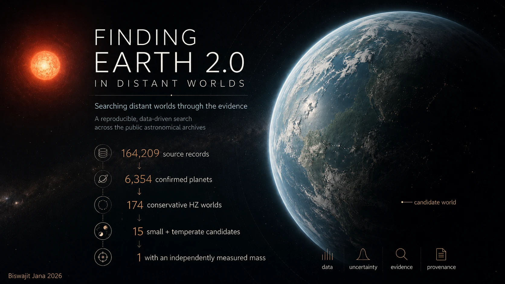
</p>

**A reproducible, data-driven search for potentially Earth-like worlds across the public astronomical archives.**

## Project tour and latest research snapshot

<p align="center">
  <a href="media/finding-earth-2-project.mp4">
    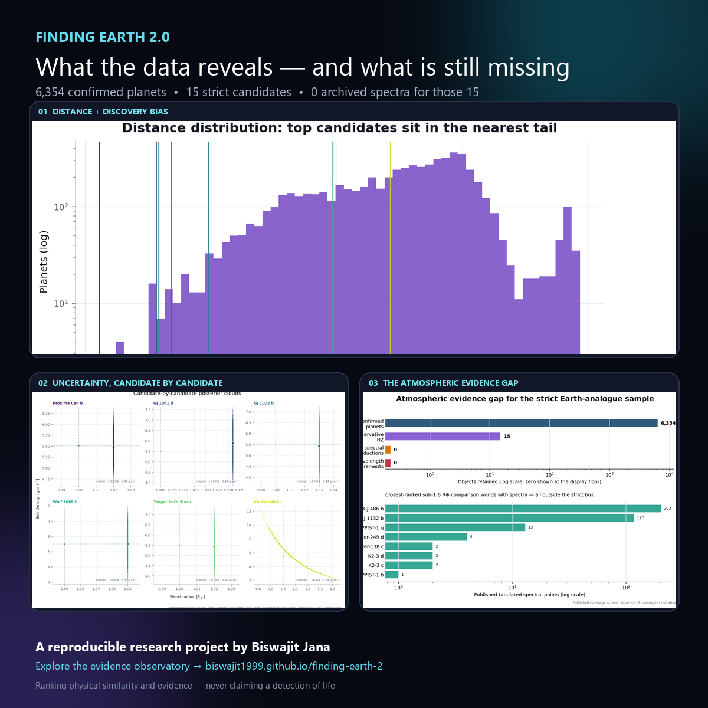
  </a>
</p>

<p align="center">
  <strong><a href="media/finding-earth-2-project.mp4">▶ Watch the 80-second project tour</a></strong>
  · <a href="https://biswajit1999.github.io/finding-earth-2/">Open the interactive observatory</a>
</p>

The card and video are direct captures of the implemented website and generated
scientific plots. Every dot in the 3D panel is a known exoplanet system with a
measured distance in the analysed catalogue; it is not an artist's impression.

<p align="center">
  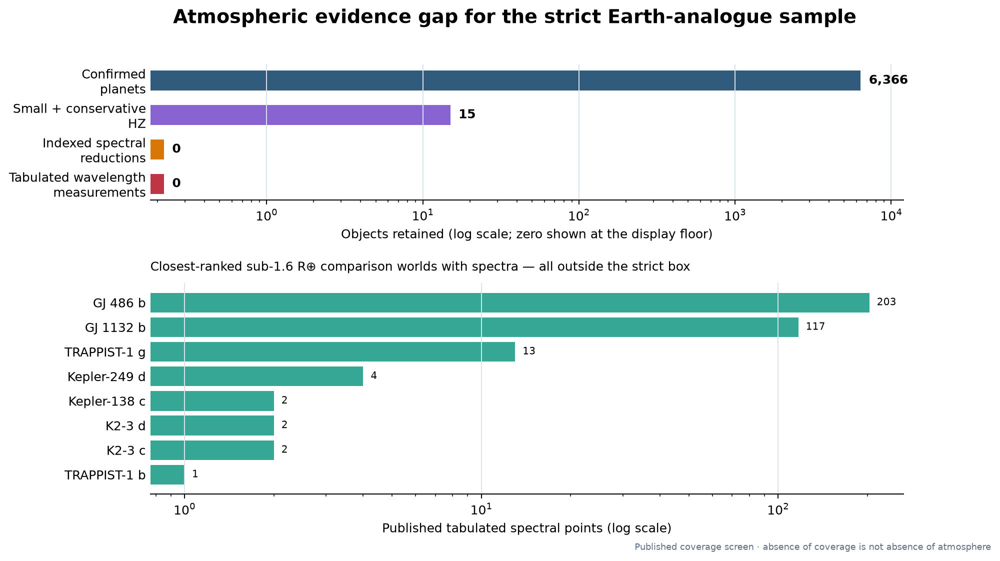
</p>

The latest spectrum cross-match retains **15** strict small-and-temperate
candidates, but finds tabulated wavelength spectra for **0** of those exact
targets. This is an observational coverage gap, not a conclusion that their
atmospheres or life are absent.

## v2 release status

**Finding Earth 2.0 v2 is publication-ready.** The project follows the funnel
from **164,209 source records** to **6,354 confirmed planets**, then to the
observed temperate-terrestrial candidate set and a separate selection-corrected
population inference. The catalogue is what our instruments and pipelines made
visible; **the catalogue is not the Universe**.

The work answers four questions:

1. Which known worlds best match explicit terrestrial-size and temperate-orbit
   criteria, and what evidence supports each value?
2. How do transit geometry, observing windows, pipeline recovery, vetting, and
   reliability reshape the population hidden behind the observed catalogue?
3. Which conclusions survive alternate composition, climate, stellar-environment,
   and mission assumptions?
4. Which feasible next measurement has the highest expected information gain?

| Release item | Status |
|---|---|
| Scientific status | v2.0; evidence-labelled, conditional inference; no life claim |
| Analysis timestamp | `2026-08-28T20:00:42Z` |
| Frozen source checkpoint | `79d6c9b59d82a184af47bb118d866f3aed87efc5` |
| Data release | [`earth2-v2-data-release/`](earth2-v2-data-release/) + deterministic ZIP; Zenodo DOI pending |
| Manuscript | [`paper/main.tex`](paper/main.tex), generated values and verified bibliography |
| Interactive observatory | [Open the live website](https://biswajit1999.github.io/finding-earth-2/) |
| Beyond Earth 2.0 | [Distance, contact and extragalactic feasibility](https://biswajit1999.github.io/finding-earth-2/beyond/) |
| Author story and roadmap | [What I learned and what I plan next](https://biswajit1999.github.io/finding-earth-2/perspective/) · [`docs/AUTHOR_VISION_AND_ROADMAP.md`](docs/AUTHOR_VISION_AND_ROADMAP.md) |
| Release documentation | [`docs/DATA_RELEASE.md`](docs/DATA_RELEASE.md) |

Reproduce and validate the publication products:

```bash
python scripts/build_publication_release.py
python scripts/validate_manuscript.py
python scripts/check_release_invariants.py
pytest -q
cd web && npm ci && npm run build && npm run audit:visual
```

<p align="center">
  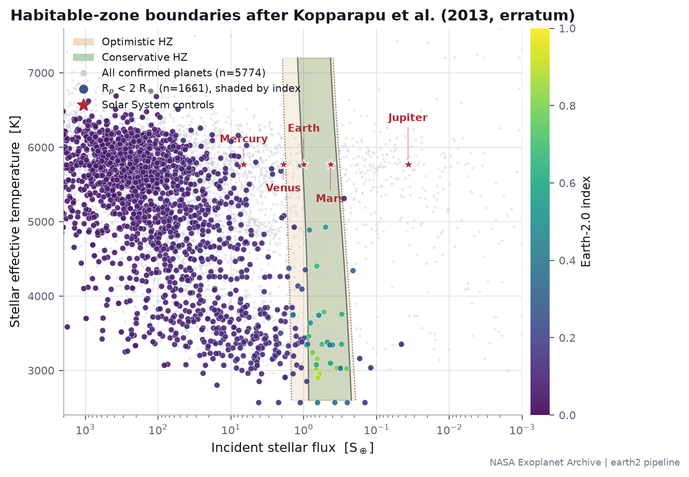
</p>

<p align="center">
  <em>Every number in this README is generated from the analysis output by
  <code>python -m earth2 report</code>. None is typed by hand.</em><br>
  <sub>Last analysis run: <code>2026-08-28T20:00:42Z</code></sub>
</p>

---

> **Scientific boundary.** The Earth-2.0 index ranks physical similarity
> and observational evidence; it does not estimate the probability that a
> planet supports life. Population analysis uses NASA Exoplanet Archive
> catalogues cross-matched against Gaia DR3 astrometry by exact source
> identifier; selected transit and radial-velocity deep dives additionally
> draw on public MAST and DACE products. ESO integration is planned but not
> yet implemented (see the archive matrix below). Candidates whose host star
> sits outside the habitable-zone model's calibrated temperature range are
> flagged and down-weighted rather than silently ranked as confident members
> — see [`docs/LIMITATIONS.md`](docs/LIMITATIONS.md).

> **Conditional DR25 population result.** A separate DR25 analysis pins the
> 114,105-star search denominator, 89-candidate inference population, all four
> false-alarm experiments, observed TCEs, known-signal exclusions and
> astrophysical FPP data. The constrained
> reliability model assigns 87 candidates and withholds two outside its MES
> domain. The survey-wide selection model evaluates all 114,105 stars and passes
> five target-isolated injection folds, physical invariants and a pinned
> KeplerPORTs regression. The hierarchical model estimates 0.692 planets per
> selected star across 50–500 days and 0.5–2 Earth radii, with a 0.267–1.918
> 95% interval under the conservative high-MES reliability endpoint. This is a
> fixed-box occurrence result, not a probability of habitability or life. See
> [`docs/DR25_RELIABILITY.md`](docs/DR25_RELIABILITY.md) and
> [`docs/DR25_SELECTION_SURFACE.md`](docs/DR25_SELECTION_SURFACE.md), plus the
> [`DR25 occurrence result`](docs/DR25_OCCURRENCE.md).

<p align="center">
  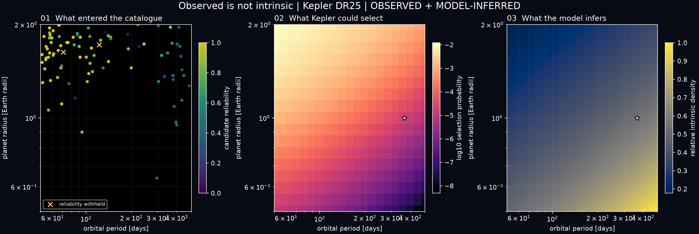
</p>

The observed catalogue and the inferred population are now connected in one
evidence-labelled product. At the Earth pivot, the released selection model has
a mean total selection probability of about **0.00198%**—roughly one selected
signal per 50,535 searched stars. The website turns this into an interactive
four-step reading while retaining the generated JSON as its source of truth.

> **Composition is an ensemble, not a radius label.** The Phase 6 release
> evaluates 3,852 planets from 0.5–4 Earth radii. Only 679 independently measured
> masses may enter the mass-radius composition models. The retained Rogers
> radius baseline, Zeng iron-silicate envelope and Otegi rocky/volatile-rich
> comparison often disagree: the median probability span is 0.251 for planets
> supported by all three views. That disagreement remains visible and is never
> multiplied into a probability of habitability. See
> [`docs/COMPOSITION_ENSEMBLE.md`](docs/COMPOSITION_ENSEMBLE.md).

---

## Abstract

This project asks a deliberately narrow question of the public exoplanet
archives: **among currently available observations, which known planets most
closely satisfy physically motivated conditions associated with an Earth-like
potentially habitable world, how strong is the evidence behind each, and where
are the major uncertainties?**

It ingests **164,209 provenance-tracked source records** from
13 archive tables, derives habitable-zone membership from the
Kopparapu et al. (2013) climate model, computes an Earth Similarity Index,
propagates every published uncertainty through **4,000 Monte Carlo draws per
planet**, and ranks candidates on four interpretable axes that are reported
separately because they genuinely disagree.

It does **not** claim to have found life, an inhabited world, or a confirmed
second Earth. It is explicit about the difference between Earth *similarity*,
habitable-zone *position*, rocky-planet *plausibility*, atmospheric
*observability*, and *evidence for biology* — five distinct things that are
routinely conflated.

---

## Key results

| | |
|---|---|
| Source records ingested | **164,209** |
| Confirmed planets analysed | **6,354** across 4,764 host systems |
| Planets with a **measured** mass | **2,240** (35.3%) |
| Planets whose mass is **inferred from radius** | 2,975 (46.8%) |
| In the **conservative** habitable zone | **174** |
| In the **optimistic** habitable zone | 279 |
| Conservative HZ **and** below 1.6 R⊕ | **15** |
| …of which have a **measured mass** | **1** |
| Planets with published transmission spectra | 104 |
| Planets with published eclipse spectra | 54 |
| Plot-ready atmospheric spectra (≥4 usable points) | 66 transmission + 31 eclipse |
| Measurement-level provenance links | 89,131 across 1,814 publications |

### Why 15 candidates does not mean 15 habitable worlds

The **15** is a screening count: confirmed planets that are nominally inside
the conservative stellar habitable zone and smaller than 1.6 Earth radii. It
does not measure surface water, atmospheric pressure, climate stability or
biology. The **0** in the spectrum-coverage figure means that none of those
exact 15 has a tabulated atmospheric spectrum in the ingested archives. It is
not a zero-percent habitability estimate.

Carbon, hydrogen, nitrogen, oxygen, phosphorus and sulfur are important to life
as we know it, but detecting a few elements or molecules is insufficient. They
are widespread and can be produced without biology; even oxygen can have
abiotic false-positive pathways. A credible assessment needs the atmosphere,
surface and stellar environment together, repeated spectra, disequilibrium
tests and explicit exclusion of non-biological explanations. Organic or
subsurface life remains possible on worlds that fail this project's narrow
Earth-analogue screen, but current observations do not establish that it exists.
See [NASA's habitable-zone explanation](https://science.nasa.gov/exoplanets/habitable-zone/),
[NASA's discussion of searching for life](https://science.nasa.gov/exoplanets/can-we-find-life/)
and the [biosignature assessment framework](https://doi.org/10.1089/ast.2017.1737).

> **The headline finding is a scarcity result.** Of 6,354 confirmed
> planets, only **15** are both inside the
> conservative habitable zone and small enough to be plausibly rocky — and only
> **1** of those has a mass that was
> actually measured rather than predicted from its radius. The search for Earth 2.0
> is not currently limited by how many planets we know about. It is limited by how
> few of them we have measured well.

---

## Top candidates

Produced by the pipeline, not selected by hand. Re-running the analysis after an
archive update re-derives this table.

| # | Planet | Earth-2.0 index | Similarity | Habitability | Confidence | R⊕ | Mass | pc |
|--:|---|--:|--:|--:|--:|--:|---|--:|
| 1 | **Proxima Cen b** | 0.876 | 0.915 | 0.946 | 0.730 | 1.02 | M sin i | 1.3 |
| 2 | **GJ 1061 d** | 0.875 | 0.874 | 0.896 | 0.846 | 1.16 | measured | 3.7 |
| 3 | **GJ 1002 b** | 0.849 | 0.914 | 0.945 | 0.644 | 1.03 | M sin i | 4.8 |
| 4 | **Wolf 1069 b** | 0.839 | 0.900 | 0.931 | 0.644 | 1.08 | M sin i | 9.6 |
| 5 | **Teegarden's Star c** | 0.823 | 0.807 | 0.948 | 0.676 | 1.02 | M sin i | 3.8 |
| 6 | **Kepler-1649 c** | 0.774 | 0.887 | 0.898 | 0.502 | 1.06 | *inferred* | 92.2 |
| 7 | **GJ 1002 c** | 0.771 | 0.751 | 0.883 | 0.644 | 1.10 | M sin i | 4.8 |
| 8 | **Kepler-1229 b** | 0.716 | 0.819 | 0.733 | 0.571 | 1.40 | *inferred* | 265.5 |
| 9 | **GJ 667 C f** | 0.702 | 0.805 | 0.676 | 0.618 | 1.45 | M sin i | 7.2 |
| 10 | **TOI-700 d** | 0.684 | 0.943 | 0.552 | 0.613 | 1.07 | *inferred* | 31.1 |
| 11 | **Kepler-442 b** | 0.671 | 0.848 | 0.569 | 0.632 | 1.34 | *inferred* | 366.0 |
| 12 | **Kepler-186 f** | 0.644 | 0.756 | 0.578 | 0.609 | 1.17 | *inferred* | 177.6 |

`Mass` reports how the mass was obtained. *inferred* means it was predicted from
the radius by a mass–radius relation and is not an independent measurement — a
distinction that changes the ranking, since density and escape velocity derived
from such a mass carry no information beyond the radius.

<p align="center">
  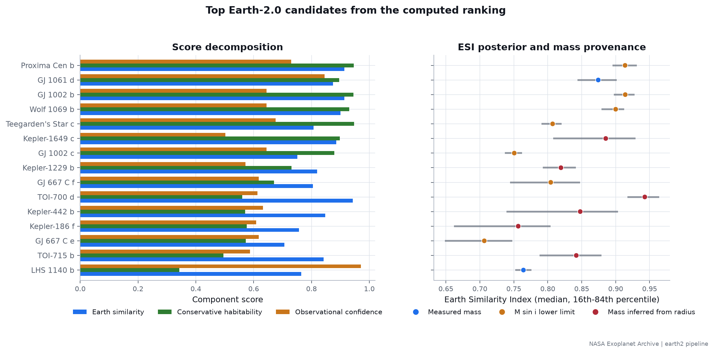
</p>

---

## Research question, stated precisely

> Among currently available public exoplanet observations and catalogues, which
> known planets or candidates most closely satisfy physically motivated
> conditions associated with an Earth-like potentially habitable world, how
> strong is the underlying observational evidence, and where are the major
> uncertainties?

Five things this project keeps strictly separate:

| Concept | What it means here |
|---|---|
| **Earth similarity** | Bulk radius, density, escape velocity and equilibrium temperature resemble Earth's. |
| **Habitable-zone position** | Incident flux is compatible with surface liquid water under a stated climate model. |
| **Rocky plausibility** | Radius is below the regime where planets are predominantly volatile-rich. |
| **Atmospheric observability** | Whether an atmosphere could be characterised with current instruments. |
| **Evidence for life** | **Not established for any planet.** No metric in this project estimates it. |

---

## Method

```
public archives  ──▶  ingest + manifest  ──▶  crossmatch  ──▶  catalogue
                                                                  │
                        ┌─────────────────────────────────────────┤
                        ▼                                         ▼
              Monte Carlo uncertainty                    habitable zone + ESI
                 (4,000 draws/planet)              (Kopparapu 2013 erratum)
                        │                                         │
                        └────────────────┬────────────────────────┘
                                         ▼
                          four interpretable component scores
                                         │
                          weighted geometric mean (non-compensatory)
                                         ▼
                            Earth-2.0 candidate index
                                         │
                     ┌───────────────────┼───────────────────┐
                     ▼                   ▼                   ▼
                 figures            results/*.csv        web export → React
```

### The four scores

Reported separately, never collapsed into one number without showing the parts.

| Score | Question | Built from |
|---|---|---|
| **Earth similarity** | How close are the bulk properties to Earth's? | Monte Carlo median ESI (Schulze-Makuch et al. 2011) |
| **Conservative habitability** | Is this consistent with a temperate rocky world? | HZ membership probability × rocky plausibility (Rogers 2015) |
| **Observational confidence** | How well is it actually measured? | Mass provenance, uncertainty coverage, reference depth, literature agreement, completeness |
| **Characterisation potential** | How feasible is atmospheric follow-up? | Kempton et al. (2018) TSM |

The composite uses a **weighted geometric mean**, not an average. Under an
arithmetic mean an ultra-hot Jupiter with superb measurements and excellent
observability scores respectably despite zero habitability — its strong
components compensate for the disqualifying one. A geometric mean is
non-compensatory.

Characterisation potential is **excluded from the default composite** (weight 0):
it measures how easy a planet is to *observe*, not how Earth-like it is, and it
structurally penalises non-transiting planets, which would demote Proxima Cen b
for a reason unrelated to its properties.

---

## Data sources

All data is retrieved live from public archives. Raw payloads are **not**
committed; the manifests that record the exact query, retrieval time and a
SHA-256 of the response are. That hash can prove *drift* -- that today's
answer no longer matches a past one -- against a living archive whose records
change over time; it cannot restore a historical byte stream the archive has
since revised. See [`docs/REPRODUCIBILITY.md`](docs/REPRODUCIBILITY.md).

| Dataset | Archive table | Records | DOI |
|---|---|--:|---|
| `gaia_dr3_crossmatch` | `gaiadr3.gaia_source` | 4,408 | — |
| `nasa_di_stars` | `di_stars_exep` | 164 | — |
| `nasa_emissionspec` | `emissionspec` | 2,361 | `10.26133/NEA11` |
| `nasa_k2pandc` | `k2pandc` | 4,068 | `10.26133/NEA1` |
| `nasa_koi_dr25` | `q1_q17_dr25_koi` | 8,054 | `10.26133/NEA4` |
| `nasa_microlensing` | `ml` | 895 | — |
| `nasa_ps` | `ps` | 40,106 | `10.26133/NEA12` |
| `nasa_pscomppars` | `pscomppars` | 6,354 | `10.26133/NEA13` |
| `nasa_spectra_index` | `spectra` | 1,826 | — |
| `nasa_stellarhosts` | `stellarhosts` | 47,857 | — |
| `nasa_tce_dr25` | `q1_q17_dr25_tce` | 34,032 | — |
| `nasa_toi` | `toi` | 8,136 | `10.26134/ExoFOP5` |
| `nasa_transitspec` | `transitspec` | 5,948 | `10.26133/NEA10` |

Plus, for deep-dive systems:

- **MAST / STScI** — public TESS and Kepler light curves via `lightkurve`.
- **DACE (University of Geneva)** — public radial-velocity time series with the
  stellar activity indicators measured from the same spectra.

### Archive integration matrix

| Source | Role in population ranking | Deep-dive role | Integrated in current release |
|---|---|---|---|
| NASA Exoplanet Archive | Primary catalogue | Spectral catalogue metadata | Yes |
| Gaia DR3 | Exact-`source_id` astrometry crossmatch (parallax, RUWE, proper motion) | -- | Yes |
| MAST | No population-wide input | Transit/light-curve products | Partial, on demand |
| DACE | No population-wide input | RV products | Partial, on demand |
| ESO | No | No systematic integration | No |

The **164,209 source records** figure above sums 12 NASA Exoplanet Archive
table retrievals plus the Gaia DR3 crossmatch (see
`results/provenance_manifest.json`) -- it is a row count, not a count of
unique planets, spectra, or independent observations. MAST and DACE
integration is currently selective/on-demand for individual deep-dive targets
rather than systematic across the full population; ESO integration was
investigated but is not yet part of this release. See
[`docs/DATA_SOURCES.md`](docs/DATA_SOURCES.md).

### Discovery methods in the analysed sample

| Method | Planets | Share |
|---|--:|--:|
| Transit | 4,688 | 73.8% |
| Radial Velocity | 1,200 | 18.9% |
| Microlensing | 283 | 4.5% |
| Imaging | 98 | 1.5% |
| Transit Timing Variations | 42 | 0.7% |
| Eclipse Timing Variations | 17 | 0.3% |
| Orbital Brightness Modulation | 9 | 0.1% |
| Pulsar Timing | 8 | 0.1% |

This distribution is **not** the true planet population — it is the shape of our
instruments. Transit surveys favour short periods and large planets relative to
their star; radial velocity favours massive planets close in. See
[`docs/LIMITATIONS.md`](docs/LIMITATIONS.md).

---

## What the analysis found

The two figures below are the ones that matter most. The evidence matrix is
this project's signature output: it makes "high score, weak evidence" visible
at a glance rather than burying it in a table column. The posterior clouds
show *why* uncertainty propagation changes the ranking — a tight cloud is a
well-measured planet; a smeared one is not, and no single error bar conveys
that as clearly as the distribution itself.

<p align="center">
  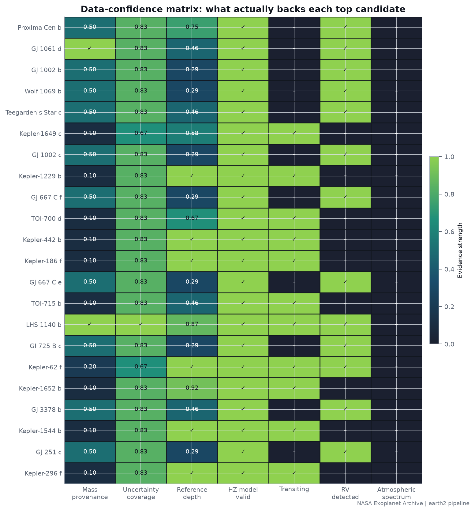
</p>

<p align="center">
  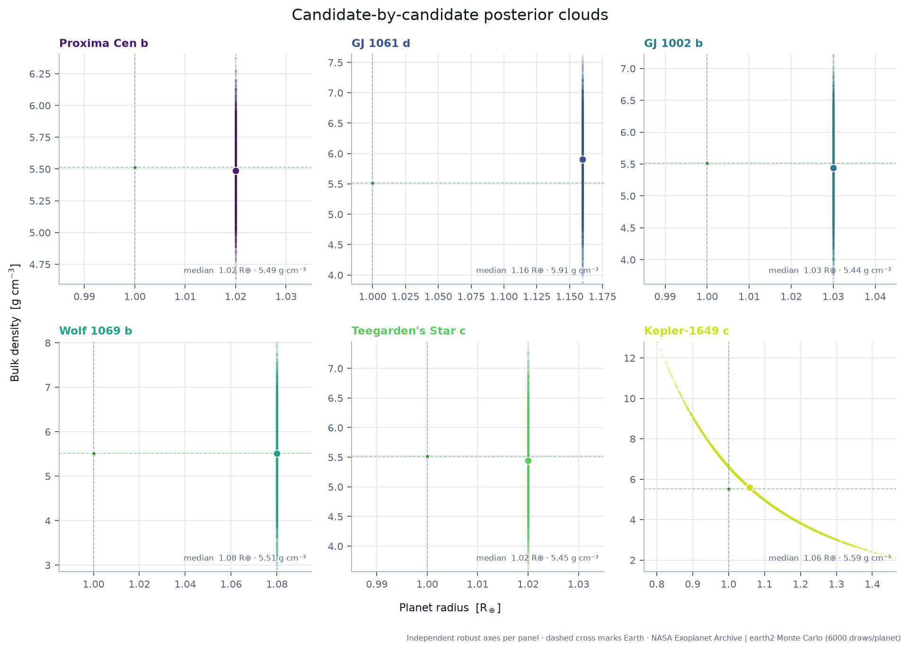
</p>

<table>
<tr>
<td width="50%">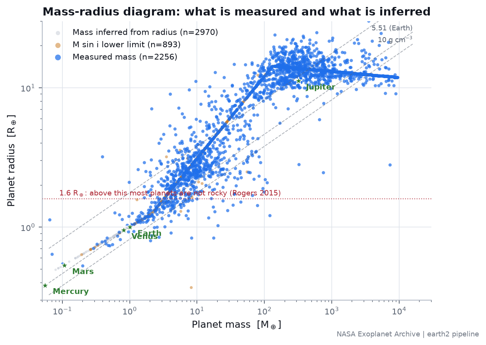</td>
<td width="50%">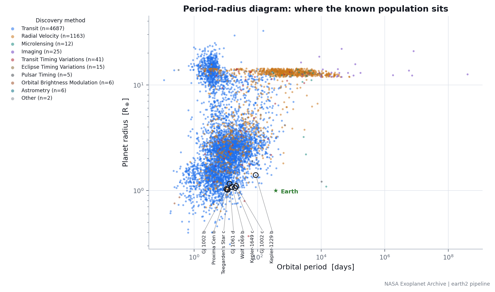</td>
</tr>
<tr>
<td width="50%">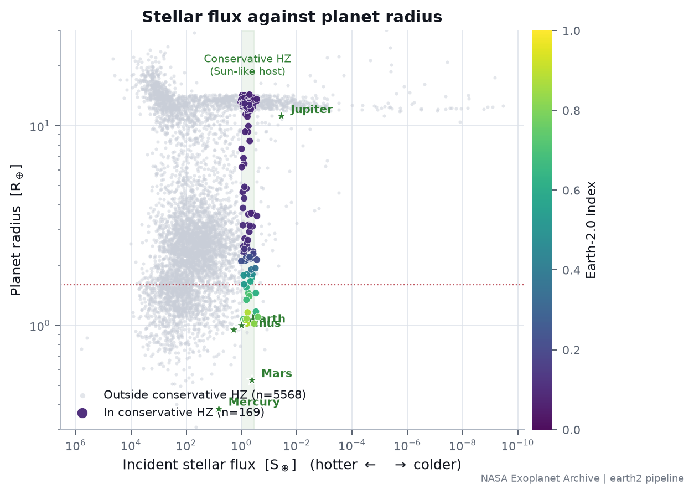</td>
<td width="50%">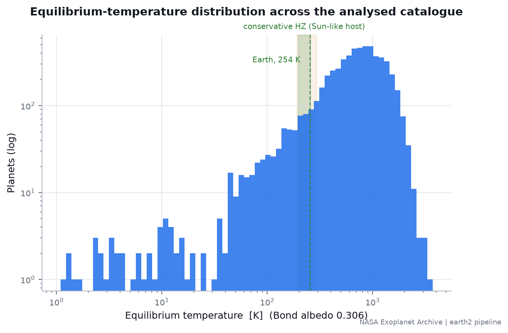</td>
</tr>
<tr>
<td width="50%">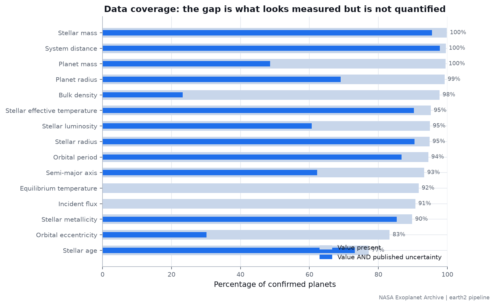</td>
<td width="50%">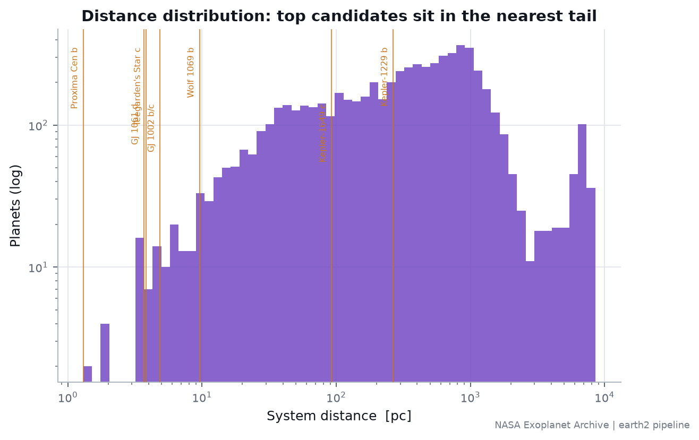</td>
</tr>
</table>

A full-resolution figure index, including the discovery timeline, the HR
diagram, the HZ diagram, and a real published transmission spectrum, is in
[`results/figures/`](results/figures/).

---

## Reproducing this

```bash
git clone https://github.com/Biswajit1999/finding-earth-2.git
cd finding-earth-2
python -m pip install -e ".[dev,products]"

python -m earth2 sync        # retrieve archive data + write manifests
python -m earth2 analyse     # catalogue, Monte Carlo, ranking
python -m earth2 figures     # publication figures
python -m earth2 deepdive    # top-system deep dives (--transit --rv for live fetch)
python -m earth2 export      # browser-ready JSON
python -m earth2 report      # regenerate this README
python scripts/build_observed_intrinsic_story.py  # population story + web payload
python scripts/build_composition_ensemble.py      # named bulk-composition models
python scripts/build_web_observatory.py           # compact evidence-labelled web release
```

Or the whole pipeline:

```bash
make all
```

The website:

```bash
cd web && npm install && npm run dev
```

Determinism: the Monte Carlo seed is fixed
(`20260824`), every retrieval carries a UTC timestamp and a
SHA-256 of the payload as received, and every transformation is recorded in
`results/transformation_ledger.json`.

---

## Repository layout

```
src/earth2/
  data_sources/    archive connectors -- return (DataFrame, Manifest), never data alone
  crossmatch/      entity resolution; never joins on string similarity
  preprocessing/   catalogue assembly, mass-provenance classification
  habitability/    habitable zone (Kopparapu) and Earth Similarity Index
  uncertainty/     Monte Carlo propagation with asymmetric errors
  ranking/         four interpretable scores + non-compensatory composite
  transit/         MAST light curves: detrend, fold, fit, validate
  radial_velocity/ DACE velocities + mandatory stellar-activity cross-check
  spectroscopy/    published atmospheric spectra + biosignature context
  provenance/      retrieval manifests and transformation ledger
  reporting/       figures, deep dives, web export, this README
web/               Next.js + React interface
results/           computed outputs -- the only source of published numbers
docs/              research notes, methods, limitations, reproducibility
```

---

## Documentation

| Document | Contents |
|---|---|
| [`docs/METHODS.md`](docs/METHODS.md) | Every equation, with citations and assumptions |
| [`docs/DATA_SOURCES.md`](docs/DATA_SOURCES.md) | Archives, tables, licensing, acknowledgements |
| [`docs/LIMITATIONS.md`](docs/LIMITATIONS.md) | What this analysis cannot establish |
| [`docs/DR25_SELECTION_SURFACE.md`](docs/DR25_SELECTION_SURFACE.md) | Survey-wide detection model, validation and products |
| [`docs/DR25_RELIABILITY.md`](docs/DR25_RELIABILITY.md) | False-alarm and astrophysical reliability contract |
| [`docs/DR25_OCCURRENCE.md`](docs/DR25_OCCURRENCE.md) | Fixed-box occurrence posterior, diagnostics and published comparisons |
| [`docs/OBSERVED_VS_INTRINSIC.md`](docs/OBSERVED_VS_INTRINSIC.md) | Evidence-labelled bridge from catalogue counts to population inference |
| [`docs/COMPOSITION_ENSEMBLE.md`](docs/COMPOSITION_ENSEMBLE.md) | Probabilistic rocky/volatile evidence and model disagreement |
| [`docs/MISSION_OBSERVATORY.md`](docs/MISSION_OBSERVATORY.md) | Separate JWST, HWO, ANDES, PLATO, Gaia and Roman evidence views |
| [`docs/INFORMATION_GAIN.md`](docs/INFORMATION_GAIN.md) | Action-specific uncertainty reduction under explicit synthetic likelihoods |
| [`docs/FALSIFICATION.md`](docs/FALSIFICATION.md) | Solar-System failure tests and candidate model sensitivity |
| [`docs/WEB_OBSERVATORY.md`](docs/WEB_OBSERVATORY.md) | Eleven-room research website, refresh policy, motion and accessibility contract |
| [`docs/RESEARCH_NOTES.md`](docs/RESEARCH_NOTES.md) | Evidence ledger built during the research pass |
| [`docs/REPRODUCIBILITY.md`](docs/REPRODUCIBILITY.md) | Seeds, versions, determinism, re-running |
| [`references/references.bib`](references/references.bib) | BibTeX bibliography |

---

## Limitations

The full list is in [`docs/LIMITATIONS.md`](docs/LIMITATIONS.md). The four that
most constrain the results:

1. **The Earth Similarity Index cannot distinguish Earth from Venus.** Venus
   scores **0.93** on this metric, because equilibrium temperature — the only
   temperature exoplanet catalogues provide — is insensitive to the runaway
   greenhouse that makes Venus's surface 737 K. Venus is carried through the
   whole pipeline as a control so this is visible in the results rather than
   asserted in a footnote.

2. **46.8% of catalogue masses were never measured.** They are
   predictions from the radius. Density and escape velocity computed from them
   re-encode the radius rather than adding information.

3. **TRAPPIST-1 sits below the habitable-zone model's validity floor.** Its host
   is 2566 K against a stated minimum of 2600 K. Results are reported both
   strictly (excluded) and with a flagged extrapolation, never silently clamped.

4. **An Earth twin's atmospheric signal is ~1 ppm.** Detecting an Earth-like
   atmosphere around a Sun-like star is far beyond current instruments; the
   candidates that are observable are so because they orbit small, cool stars,
   which brings its own habitability complications.

---

## Citation

If this work is useful to you, please cite it via [`CITATION.cff`](CITATION.cff),
and cite the underlying archives and papers — they did the observing.

---

## Licence

[MIT](LICENSE) for the software. The astronomical datasets remain governed by
their originating archives; see [`docs/DATA_SOURCES.md`](docs/DATA_SOURCES.md)
for required acknowledgements.

## Author

**Biswajit Jana** — [github.com/Biswajit1999](https://github.com/Biswajit1999)
