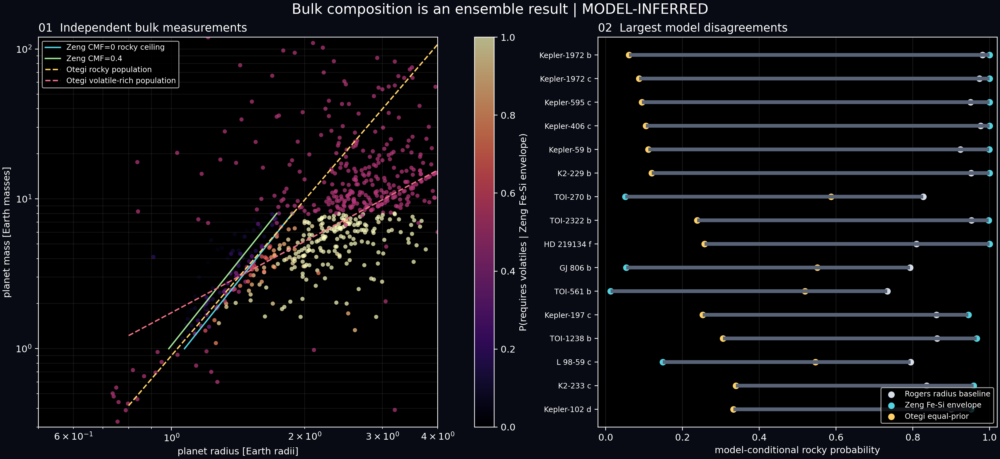

# Probabilistic bulk-composition evidence ensemble

Status: **Phase 6 model release**. The v1 radius-only rocky-plausibility
logistic remains available for continuity, but it is no longer the only view of
composition. This release adds named mass-radius models and preserves their
disagreement.

## What is inferred

The builder evaluates 3,852 planets between 0.5 and 4 Earth radii. It accepts a
catalogue mass for two-dimensional composition inference only when its
provenance class is `measured`; 679 planets pass that gate. Minimum masses,
upper limits, deprojected scenarios, missing masses and values predicted from a
mass-radius relation do not pass it.

The result reports separate model-conditional quantities:

- `p_rocky_rogers_radius_only`: the retained smooth radius baseline around the
  1.6-Earth-radius population transition from Rogers (2015);
- `p_rocky_zeng_fe_si_envelope`: probability that mass-radius draws are no less
  dense than the published zero-core-mass rocky ceiling;
- `p_requires_volatiles_zeng`: probability that the radius is too large for the
  published Zeng, Sasselov & Jacobsen (2016) iron-silicate family;
- `p_consistent_with_terrestrial_composition_zeng`: probability of lying
  between the CMF=0 and CMF=0.4 curves inside the published 1–8 Earth-mass
  domain;
- `p_rocky_otegi_equal_prior`: an equal-prior comparison of the Otegi, Bouchy &
  Helled (2020) empirical rocky and volatile-rich population relations.

These values are not multiplied into a habitability score. No core or mantle
fraction is reported. Bulk mass and radius are degenerate with respect to
interior layering, water content and atmospheric envelopes.

## Model assumptions

The Zeng approximation is

`R/R_Earth = (1.07 - 0.21 CMF) (M/M_Earth)^(1/3.7)`

and is evaluated only for 1–8 Earth masses and CMF from 0 to 0.4. Draws outside
that domain are excluded, and the supported-draw fraction is published.

The Otegi empirical relations are

`M_rocky = 0.90 R^3.45`

and

`M_volatile = 1.74 R^1.58`.

The comparison uses equal scenario priors and a declared 0.20-dex model-scatter
floor. Results at 0.10 and 0.30 dex are included as sensitivity columns. Equal
priors are a comparison device, not measured population fractions.

The Wolfgang, Rogers & Ford (2016) relation `M=2.7 R^1.3` with 1.9 Earth-mass
intrinsic scatter is retained as a prediction reference. Its location is
published for radius-supported planets with
`wolfgang_prediction_is_dynamical_mass=false`; it never enters independent
composition evidence.

## Covariance and uncertainty

Published asymmetric mass and radius errors are propagated through 4,000 draws
per planet. The sampler accepts a reported mass-radius correlation coefficient
when available. The current flattened catalogue does not carry those
covariances, so each record says `unavailable_assumed_zero`. This is an explicit
limitation, not evidence of independence.

Among planets supported by all three rocky views, the median span between model
probabilities is about 0.25 and the 90th percentile is about 0.48. This spread is
part of the result. It shows why a single radius cutoff cannot stand in for a
composition measurement.

## Reproduction

```powershell
python.exe scripts/build_composition_ensemble.py
python.exe -m pytest tests/test_composition.py -q
python.exe scripts/check_release_invariants.py
```

The JSON includes hashes of the input catalogue, builder and model module. The
product manifest covers the CSV, JSON and PNG/SVG figure.

## Primary references

- Rogers (2015), *The Astrophysical Journal* 801, 41,
  [doi:10.1088/0004-637X/801/1/41](https://doi.org/10.1088/0004-637X/801/1/41).
- Wolfgang, Rogers & Ford (2016), *The Astrophysical Journal* 825, 19,
  [doi:10.3847/0004-637X/825/1/19](https://doi.org/10.3847/0004-637X/825/1/19).
- Zeng, Sasselov & Jacobsen (2016), *The Astrophysical Journal* 819, 127,
  [doi:10.3847/0004-637X/819/2/127](https://doi.org/10.3847/0004-637X/819/2/127).
- Otegi, Bouchy & Helled (2020), *Astronomy & Astrophysics* 634, A43,
  [doi:10.1051/0004-6361/201936482](https://doi.org/10.1051/0004-6361/201936482).


