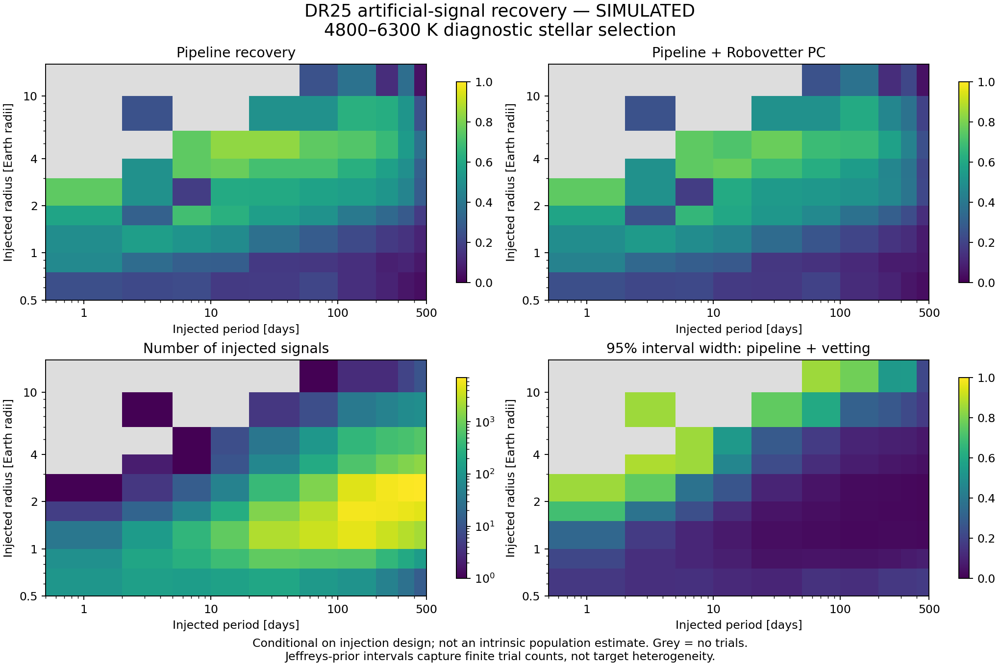

# Kepler DR25 completeness integration

Status: source adapter and experiment diagnostics, not a released occurrence
model. The additive `earth2.population` package leaves v1 products untouched.

False-alarm experiments, astrophysical false-positive probabilities and the
fixed candidate denominator are documented separately in
[DR25_RELIABILITY.md](DR25_RELIABILITY.md). Completeness and reliability remain
separate conditional probabilities throughout the implementation.

## Data and reproduction

Run `python -m earth2.population --root .` (`python.exe` on this Windows
checkout). It retrieves and validates three official products: original DR25
stellar parameters and search metrics, INJ1 pixel-level injection outcomes, and
INJ1 Robovetter dispositions. Downloads have a 100 MB bound per product.
Raw payloads stay in the ignored `data/raw/kepler_dr25/` directory; source
manifests are committed under `data/manifests/population/`. A cache hit verifies
the original bytes, schema and rows without changing the retrieval timestamp.
Missing half of a cache pair or changed bytes causes an error requiring explicit
repair. Raw hashes, query, URL, retrieval time, release, rows, acknowledgement,
software commit and adapter hash accompany each input. No data licence is
invented or inherited from this repository's software licence.

The archive describes the [operational detection products](https://exoplanetarchive.ipac.caltech.edu/docs/Kepler_completeness_reliability.html)
and the separate [artificial-signal experiments](https://exoplanetarchive.ipac.caltech.edu/docs/KeplerSimulated.html).
Technical definitions and limitations are audited in [the literature register](LITERATURE_V2.md),
especially KSCI-19110-001 (injections), KSCI-19111-002 (per-target detection) and
KSCI-19114-002 (Robovetter).

## What the diagnostic estimates

For an explicitly selected stellar subset, the exported radius/period grid
counts injected signals, pipeline recoveries and recovered signals classified
as planet candidates. Each fraction has a 95% equal-tail Beta posterior interval
under a stated Jeffreys Beta(0.5, 0.5) prior. Empty cells are undefined. These
intervals capture finite trial counts under conditional exchangeability;
they do not capture model misspecification or target heterogeneity.

Injected physical radii are reconstructed from injected radius ratio and the
**original** DR25 stellar radius, using Astropy's IAU nominal solar and
equatorial Earth radius constants. A fitted recovered radius or a supplemental
stellar radius would alter the experiment's coordinates. The stellar cut is
4800–6300 K, log(g) >= 4, radius <= 1.5 solar radii, finite positive mass,
dataspan, six-hour CDPP and MES threshold, and duty cycle in (0,1]. This is a
documented diagnostic selection, not a claim to reproduce a published GK sample.

`results/population/dr25_summary.json` reports all joins and exclusions;
`dr25_injection_grid.csv` reports cell counts and intervals. All outputs carry
**SIMULATED** because the input signals were artificially injected into real
Kepler observations. They measure the pipeline's response to that experiment.

## Probability contract

The geometry function returns the isotropic-orientation probability conditional
on eccentricity and planet argument of periastron (radians). Its default b<1
criterion matches the injection domain. Grazing-transit geometry is a separate
explicit option. The conjunction approximation assumes a small stellar-radius
to orbital-distance ratio; intersecting orbits are rejected.

Detection combines geometry, observing window, conditional pipeline recovery and
conditional vetting. A recovery function already marginalised over phase includes
the window, so the API rejects adding that window twice. Candidate reliability
is a purity problem and is deliberately absent from the detection multiplier.
Calibration contracts prevent silent transfers between survey releases, stellar
samples or impact-parameter conventions.

## Gates still open

An empirical grid averages over the injection proposal, which depends on the
target properties and expected signal strength. It is not automatically the
selection averaged over a proposed intrinsic population. Before a real
occurrence result can be reported, implement and validate the per-target model
or an appropriate injection-proposal correction; establish the searched-target
denominator; incorporate false alarms separately from astrophysical false
positives; propagate stellar and planet measurement uncertainty; validate
synthetic recovery and compare identical population domains with published work.
The 198,640 searched light curves cited by the experiment documentation must not
be silently substituted with all rows in an archive stellar table.

Tests cover Earth/Sun geometry, eccentric orientation, window double-counting,
survey mismatch, finite binomial intervals, schema drift, TCE/KIC joins, missing
hosts, original-radius convention, cache corruption and timestamp preservation.

## Delivered recovery-code discrepancy

The live INJ1 table has 100,917 code-0, 44,791 code-1 and 586 code-2 records.
Its header and KSCI-19110-001 §3 describe only 0 and 1. The initial strict parser
correctly stopped on this mismatch. Code-2 recovered periods are predominantly
multiples/fractions of the injected period; §2 of the technical report permits
ephemeris matches at period aliases. The diagnostic counts both positive codes
only when they join a target-consistent TCE in the official INJ1 Robovetter
product, preserving the raw code and reporting code-2 counts separately. This
is an explicit inference from the delivered products, not a claim that the
header documents code 2 or that those periods are correct. Population inference
must model period misidentification or demonstrate insensitivity to excluding
these records. The additional regression test covers this real archive case.

## Retrieved experiment snapshot

The committed [summary](../results/population/dr25_summary.json) and
[cell data](../results/population/dr25_injection_grid.csv) are generated from
the three hash-verified source manifests. All 146,294 injections have a stellar
match. The diagnostic sample has 114,105 archive stars and 84,556 injection
trials, of which 30,012 are recovered and 26,219 pass vetting. The displayed
radius/period domain contains 84,445 trials; 111 selected trials fall outside
it. Eleven of 90 cells have no trials. These are sample-design facts, not
astronomical planet counts or an intrinsic rarity statement.

