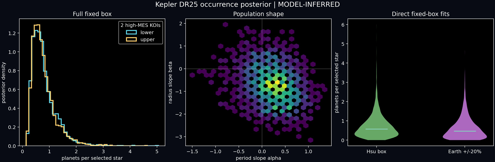

# Kepler DR25 fixed-box occurrence posterior

Status: **conditional model release**. This is the project's first real
intrinsic population result. It estimates planets per selected Kepler GK dwarf
inside explicit period-radius boxes. It does not estimate life, confirmed
habitability, or occurrence inside a star-dependent habitable zone.

## Primary fitted domain

The baseline fit uses 114,105 selected DR25 targets and the 89-candidate
population defined before the selection and reliability models were fitted.
The fitted domain is 50–500 days and 0.5–2.0 Earth radii. The population is a
normalized separable power law per `d ln P d ln R`; its normalization `F` is
planets per selected star integrated over that whole box.

Two candidates have MES above the validated false-alarm reliability ceiling of
30. The release does not extrapolate. It reports two endpoints: false-alarm
reliability zero and one for those two candidates, while retaining their
delivered astrophysical FPP. Because adding the short-period, large-radius
candidates also changes the inferred slopes, the integrated-rate endpoints
need not be numerically ordered.

| High-MES reliability endpoint | Median F | 95% credible interval | Mean imputed valid candidates |
|---|---:|---:|---:|
| False-alarm reliability 0 | 0.692 | 0.267–1.918 | 53.98 |
| False-alarm reliability 1 | 0.677 | 0.260–1.911 | 55.92 |

This broad-domain rate is the most stable result in the release. Neither slope
posterior piles up on the `[-6,6]` numerical grid boundary. Posterior-predictive
upper-tail probabilities are 0.510 for count, 0.474 for mean log period and
0.521 for mean log radius.

## Earth-centred quantities

The baseline broad-domain posterior can be integrated into smaller boxes. This
borrows population-shape information from all 89 candidates and is therefore a
model projection, not an independent count in the smaller box.

| Derived quantity | Median | 68% interval | 95% interval |
|---|---:|---:|---:|
| Differential `Gamma_Earth` at 365.25 d, 1 R_Earth | 0.246 | 0.121–0.467 | 0.057–0.781 |
| 237–500 d, 0.75–1.5 R_Earth | 0.122 | 0.062–0.227 | 0.031–0.376 |
| Earth +/-20% in period and radius | 0.041 | 0.020–0.079 | 0.010–0.132 |

`Gamma_Earth` has units of planets per selected star per `d ln P d ln R`. The
other two rows are integrated fixed-period boxes. None is the classical
star-by-star habitable-zone `eta_Earth`.

Direct fits confined to the two small boxes are also retained as diagnostics.
They contain only 4.09 and 1.48 mean imputed valid candidates, respectively,
and yield medians 0.579 and 0.464 with 95% intervals extending to 2.28 and 2.09.
Their prior and piecewise-family shifts are large. They should not replace the
broad-domain projections as headline constraints.

## Reliability changes the conclusion

When instrumental false-alarm correction is removed while the delivered
astrophysical FPP remains, the broad-domain median rises from 0.692 to 1.694.
The model-projected Hsu box rises from 0.122 to 0.395 and the Earth +/-20% box
rises from 0.041 to 0.138. This is why Robovetter score is never substituted for
candidate reliability and why reliability is not folded into detection
completeness.

## Sensitivity and diagnostics

The full-box median is 0.679 with selection held at its point estimate. Fitted
selection-coefficient uncertainty is therefore smaller than the candidate and
population-model uncertainties. Setting radius measurement errors to zero
changes the median to 0.521; multiplying them by 1.5 changes it to 0.925.
Changing the slope-prior width moves it from 0.634 to 0.702. A 3x3
piecewise-constant population gives 1.062 with a very broad 0.236–5.156 95%
interval, exposing population-family uncertainty rather than hiding it.

The direct 14x12 all-target quadrature agrees with a separate 20x18 integration
of the released 21x17 selection surface to within 0.64% across the complete
slope grid. At individual quadrature nodes, 95% of interpolation differences
are below 1.36% and the maximum is 1.74%.

All three fitted boxes pass count posterior-predictive checks. The small-box
period-mean tail probabilities are 0.191 and 0.135, which is mild shape tension
and another reason to retain the alternative-family results. These diagnostics
are posterior-predictive checks, not frequentist p-values.

## Published constraints

The broad-model Hsu-box 84th percentile is 0.227, below the Hsu et al. (2019)
0.27 upper benchmark and inside their 0.03–0.40 planning range. The project's
`Gamma_Earth` interval also overlaps their published 0.06–0.76 range. This is a
useful external consistency check, not a line-by-line reproduction of their ABC
analysis or Gaia DR2 stellar catalogue.

For the Earth +/-20% box, the project obtains 0.041 compared with Bryson et al.
(2020) 0.015 after reliability correction and 0.034 without it. The broad
intervals overlap, but the medians and reliability models differ. The direct
box diagnostic is much less constrained. The project therefore records
compatibility at current uncertainty, not numerical identity.

Bryson et al. (2021) report a star-dependent incident-flux habitable-zone
estimand. It is not numerically compared with these fixed-period boxes.

## Reproduction

```powershell
python.exe scripts/run_hierarchical_validation.py --root .
python.exe scripts/fit_occurrence_model.py --root . --draws 3000
python.exe scripts/check_release_invariants.py
```

The first occurrence run evaluates every target at 408 quadrature nodes and
writes `dr25_occurrence_exposure.csv`. Later runs reuse it only when the
selection model, stellar source, quadrature contract and derivative code hashes
match. The product manifest covers the exposure, posterior samples, summaries,
published comparison and PNG/SVG figure.


