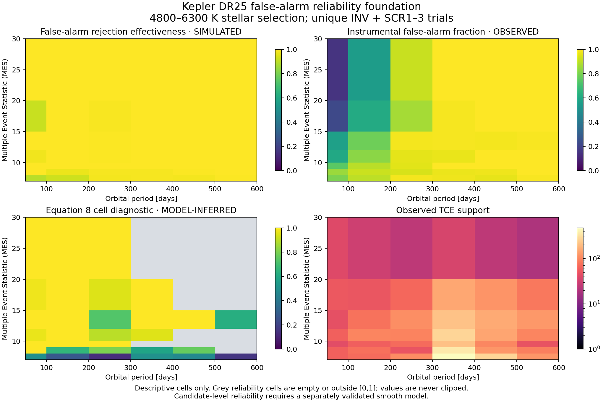

# Kepler DR25 reliability foundation

Status: validated input and finite-cell diagnostic. This is not a released
candidate-reliability surface and not an intrinsic occurrence result.

## Why reliability is separate

Completeness asks how often a real planet enters the catalogue. Reliability
asks what fraction of catalogue candidates are real planets. Multiplying a
detection efficiency by a candidate purity would mix two conditional
probabilities and bias an occurrence likelihood. Finding Earth 2 therefore
keeps the terms separate:

- pipeline and vetting completeness come from injected signals and are labelled
  **SIMULATED**;
- the false-alarm rate in the real TCE population is labelled **OBSERVED**;
- false-alarm reliability and astrophysical planet probability are labelled
  **MODEL-INFERRED**;
- no candidate receives a total reliability until the smooth model and its
  uncertainty pass validation.

The operational product definitions are maintained by the [NASA Exoplanet
Archive](https://exoplanetarchive.ipac.caltech.edu/docs/Kepler_completeness_reliability.html).
The probability relationship follows Bryson et al. (2020),
[arXiv:1906.03575](https://arxiv.org/abs/1906.03575).

## Frozen inputs

The archive adapter validates the complete observed table and four independent
false-alarm experiments:

| Product | Parsed rows | Header-declared rows | Role |
|---|---:|---:|---|
| Observed TCEs | 32,530 | 32,534 | Real detections |
| Inverted light curves | 19,531 | 19,536 | Artificial false alarms |
| Scramble 1 | 24,209 | 24,213 | Artificial false alarms |
| Scramble 2 | 24,217 | 24,222 | Artificial false alarms |
| Scramble 3 | 19,811 | 19,811 | Artificial false alarms |

Four files have a small, stable disagreement between the `nrows` header and
the delivered data rows. Both values are pinned in the manifests. SCR2 also has
12 official not-transit-like false alarms with zero recorded transits. They are
preserved because the period–MES reliability diagnostic does not use transit
count. Source bytes are never rewritten to make these facts disappear.

Known astrophysical signals and periodic contaminants must be removed from the
inverted and scrambled experiments before estimating false-alarm rejection.
The four drop lists and the DR25 astrophysical false-positive probability table
are retrieved from Steve Bryson's public occurrence repository at immutable
commit `d200f54b6f0df49e0dae530e69983cdce5397bfb`. Each manifest gates the HTTPS
payload against both its SHA-256 and Git blob SHA-1.

The drop lists contain identifiers absent from the live delivered tables: 4 for
INV, 542 for SCR1, 501 for SCR2 and 828 for SCR3. This likely reflects product
version history; it is reported as an upstream mismatch. Cleaning removes every
identifier that is present and never invents a replacement.

## Observed false-alarm classification

The not-transit-like flag (`NTL=1`) identifies instrumental false alarms in the
observed population. The pinned occurrence notebook also retains five
visually-inspected `NTL=0` false positives as instrumental artifacts:

`002716853-02`, `004371172-01`, `004557341-01`, `009394762-01`, and
`011401822-02`.

Other observed `NTL=0` false positives remain in the astrophysical
false-positive partition. That partition is handled by the independent FPP
table, not counted in the instrumental false-alarm numerator.

After applying the 4800–6300 K stellar contract, the radius, period and MES
domain (0.5–15 Earth radii, 50–600 days and MES 7–30), matched drop lists, and
the observed exclusion used by the reference code, the diagnostic contains:

| Quantity | Count |
|---|---:|
| Unique INV + SCR1–3 trials | 11,104 |
| Trials rejected as false positive | 11,013 |
| Observed TCEs | 4,603 |
| Observed instrumental false alarms | 4,284 |

## Finite-cell diagnostic

For each period–MES cell, `E_FA` is the fraction of artificial false alarms the
Robovetter rejects and `F_FA` is the instrumental false-alarm fraction among
observed TCEs. The diagnostic evaluates Bryson et al. equation 8:

```text
R_FA = 1 - [F_FA / (1 - F_FA)] × [(1 - E_FA) / E_FA]
```

Component intervals use Jeffreys `Beta(0.5, 0.5)` posteriors. Each non-empty
cell also receives 20,000 deterministic joint draws through the equation. Raw
reliability draws are never clipped to `[0,1]`; out-of-range behaviour remains
visible as a sign that a sparse, independent cell estimate is not an adequate
probability model. Of 42 cells, 17 pass the stated finite-count and point-value
diagnostic, 16 have low finite-sample support and 9 have point estimates outside
the probability space.

The pinned research notebook repeats the one INV sample three times before
pooling it with three SCR samples. That balances manipulation families for its
smooth fit, but repeated rows are not independent binomial observations. This
project's cell table pools the uniquely delivered rows and records the method
difference. A later smooth model must represent experiment effects explicitly
and pass posterior predictive validation.



## Fixed analysis population

The companion population contract selects archive stars with 4800–6300 K,
`log(g) >= 4`, radius at most 1.5 solar radii and finite positive search-quality
fields. KOIs must have DR25 pipeline disposition `CANDIDATE`, all four archive
false-positive flags equal to zero, finite period/radius/MES, a selected host,
0.5–2.0 Earth radii and 50–500 day period. Bounds are inclusive.

This gives 89 eligible candidates. Eleven also lie in the Hsu et al. comparison
box of 0.75–1.5 Earth radii and 237–500 days. These are observed catalogue
counts, not occurrence rates and not statements about intrinsic rarity.

Every eligible candidate matches an official observed TCE and a finite pinned
FPP value. The full FPP release has 8,054 rows and 178 missing probabilities.
Two rows have archive periods that differ from the period stored with the FPP
release by more than one day; both are named in the summary artifact. The
current analysis uses the archive KOI period for selection and retains the FPP
period as an audit field.

`koi_score` is a Robovetter disposition score, not a calibrated candidate
reliability. The exported population table keeps it visible while setting
`robovetter_score_is_candidate_reliability=false`. Astrophysical planet
probability is `1 - fpp_prob`; false-alarm reliability and total reliability
remain missing by design.

## Published estimands

The comparison registry prevents mismatched numbers from being placed side by
side as if they measured the same quantity:

- [Hsu et al. (2019)](https://arxiv.org/abs/1902.01417) report an 84.13th
  percentile upper limit below 0.27 planets per FGK star and a recommended
  planning range 0.03–0.40 for 0.75–1.5 Earth radii and 237–500 days.
- [Bryson et al. (2020)](https://arxiv.org/abs/1906.03575) show that reliability
  correction materially changes an Earth-centred box estimate, but their box
  and stellar contract differ from this project's inference domain.
- [Bryson et al. (2021)](https://arxiv.org/abs/2010.14812) report conservative-HZ
  bounds of 0.37 and 0.60 planets per star under two completeness extrapolation
  assumptions for 0.5–1.5 Earth radii and 4800–6300 K stars. This is a
  star-dependent instellation estimand, not the fixed period box used here.

No project value is compared numerically yet because no project intrinsic
posterior has been released.

## Reproduction and remaining gate

Run:

```powershell
python.exe scripts/build_population_foundation.py --root .
```

The command verifies all eleven raw products against their manifests and emits
the analysis population, cell table, figure, comparison registry and summary
under `results/population/`. The next gate is a smooth false-alarm model with
experiment-aware uncertainty, held-out checks and synthetic recovery. Only
after that model joins the per-target selection function may the hierarchical
period–radius likelihood produce a real occurrence posterior.
