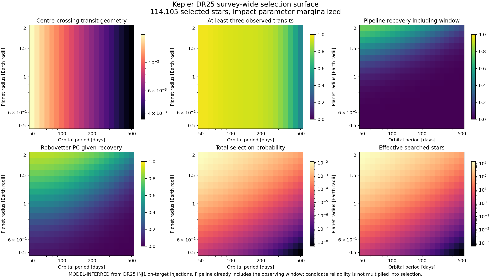

# Kepler DR25 survey-wide selection surface

Status: **validated model release; not an occurrence-rate release**. The
machine-readable products are in `results/population/` and are regenerated by
`python.exe scripts/build_selection_surface.py --root .`.

This stage answers one specific question: for a planet with a stated radius and
period drawn around one of the selected DR25 stars, what fraction of the
intrinsic population should enter the final planet-candidate catalogue? It does
not ask whether a catalogue entry is genuine. Detection completeness and
candidate reliability remain different conditional probabilities.

## Fixed population and evidence

The denominator contains all 114,105 original DR25 stellar rows satisfying the
declared 4800–6300 K, `log(g) >= 4`, radius at most 1.5 solar radii and finite
search-metric criteria. The INJ1 experiment covers 84,556 of those targets;
29,549 selected stars without an INJ1 trial remain in the denominator. The
model learns how recovery varies with stellar properties from the covered
targets and evaluates every selected star rather than dropping uncovered
targets.

The calibration domain is 50–500 days and 0.5–2 Earth radii. It contains 43,350
on-target injected signals, 11,604 positive recoveries, 10,265 recovered signals
classified as planet candidates by the Robovetter, and 138 documented
period-alias code-2 recoveries. All inputs come from the hash-verified official
DR25 stellar, INJ1 injection and INJ1 Robovetter products described in
[DR25_COMPLETENESS.md](DR25_COMPLETENESS.md).

## Per-target calculation

For a circular orbit, the semi-major axis follows Kepler's third law. At impact
parameter `b`, the first-to-fourth-contact duration is

```text
T14 = P/pi * asin(sqrt((1 + Rp/Rstar)^2 - b^2) / (a/Rstar)).
```

The phase-averaged probability of observing at least three transits mixes the
binomial survival probabilities for `floor(dataspan/P)` and the adjacent
integer opportunity count, weighted by the fractional orbital phase. The
transparent pre-calibration signal approximation is

```text
MES_raw = (Rp/Rstar)^2 * 10^6 / CDPP(T14)
          * sqrt(dataspan * dutycycle / P),

CDPP(T14) = CDPP_6hr * (T14 / 6 hr)^slope,
```

using the delivered short- or long-duration CDPP slope on the appropriate side
of six hours. A ridge-regularized log-linear fit maps this approximation to the
official injected `Expected_MES`. The fit retains target duty cycle, dataspan,
CDPP slopes, radius, surface gravity and temperature so the calibration does
not pretend those effects are identical for all stars.

Pipeline recovery and conditional Robovetter acceptance use separate logistic
models:

```text
logit(p) = beta0 + beta1*log(MES/7) + beta2*xP
           + beta3*logit(window)/12 + beta4*xP^2,
```

where `xP` scales log-period to `[-1, 1]`. Both models constrain `beta1 >= 0`,
so a stronger signal cannot lower detection or vetting probability. The
pipeline fit also constrains `beta3 >= 0`, so a better observing window cannot
lower recovery. Its response is already calibrated to INJ1 recovery and
includes the window; the separately exported mean-window column is diagnostic
and is not multiplied a second time.

The total probability at each star is

```text
S(P, Rp | star) = p(b < 1) * C_pipeline+window(P, Rp, star)
                 * C_vetting|recovered(P, Rp, star).
```

Candidate false-alarm reliability and astrophysical planet probability are
absent from this expression. Impact parameter is integrated over a uniform
transiting-orientation distribution with five-node Gauss–Legendre quadrature.
The released surface averages the result after evaluating every selected star;
`effective_stars` is the sum of the individual target probabilities.

## Validation that gates the release

Five deterministic SHA-256 target folds keep every injection around a star
entirely in training or testing. All five folds pass. MES log-RMSE ranges from
0.1526 to 0.1562, absolute log-bias never exceeds 0.00145, and 90.7–91.6% of
held-out expected-MES predictions fall within 25% of the delivered value.

In every fold, pipeline, conditional-vetting and combined pipeline-plus-vetting
predictions beat a constant training-fraction baseline on both Brier score and
log loss. Pipeline Brier scores are 0.0820–0.0838, compared with
0.1916–0.1988 for the fold-matched baselines. Combined Brier scores are
0.0796–0.0830, compared with 0.1764–0.1838.

An independent regression check evaluates the same KIC 3429335 target as the
pinned NASA KeplerPORTs example. Across the 25 period-radius cells shared by the
declared domain, mean absolute pipeline difference is 0.02261, RMSE is 0.04863
and maximum absolute difference is 0.1818. This is a tolerance check between
different implementations, not a claim that the empirical approximation
reproduces every KeplerPORTs contour. The held-out INJ1 predictions are the
primary validation.

The final 357-cell surface passes four fail-closed invariants: every probability
is finite and bounded, total selection never exceeds transit geometry,
`effective_stars` exactly factorizes as target count times mean selection, and
selection is nondecreasing with planet radius at every period. Alternative MES
ridge penalties change the combined injection probability by at most 0.000014;
alternative detection penalties change it by at most 0.00251.



## Products and interpretation

- `dr25_selection_surface.csv` contains every target-averaged factor, total
  selection and effective-star exposure on the fixed grid.
- `dr25_selection_model.json` contains the denominator, domain, fitted
  coefficients, covariance matrices, constraints, source hashes and formulas.
- `dr25_selection_validation.json` contains all five held-out folds,
  fold-matched baselines, invariants, regularization sensitivity and the pinned
  reference comparison.
- `dr25_keplerports_selection_comparison.csv` exposes every cell of the
  independent target check rather than reporting only aggregate scores.
- `dr25_selection_products.json` records bytes and SHA-256 for the complete
  release.

The surface is an exposure model. It is not an intrinsic planet distribution,
an eta-Earth estimate or a corrected rarity. Its coefficient covariance is
available, but the current CSV is a point surface. An occurrence likelihood
must propagate selection calibration, stellar and planet measurement error,
candidate reliability, code-2 period treatment and population-shape uncertainty
before reporting a population rate.
